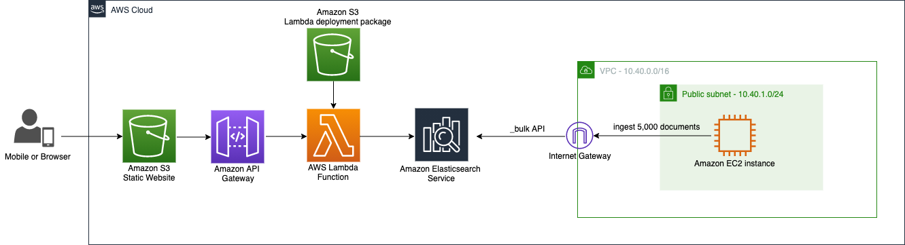
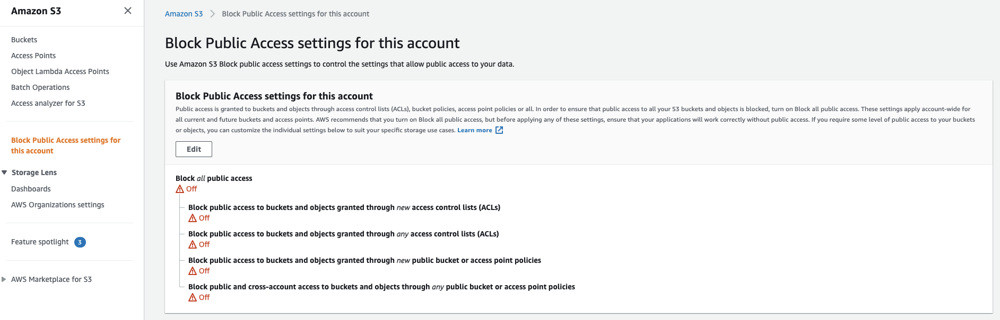

# Building a search application with Amazon ElasticSearch

We will create a search application with Amazon Elasticsearch Service. Instead of using a server to host the frontend application and then authorize the server to call the Elasticsearch APIs directly and have the server send requests to Amazon ES, we're going to use Amazon API Gateway to restrict users to a subset of the Elasticsearch APIs and AWS Lambda to sign requests from API Gateway to Amazon ES.

## Requirements

* **AWS Account:** If you don’t have an account nor an account provided to you, [click here](https://aws.amazon.com/es/free/?all-free-tier.sort-by=item.additionalFields.SortRank&all-free-tier.sort-order=asc).
* **Text editor (optional):** Just to make things easier and more organised.

## Architecture



What you have here is a VPC in which the Amazon EC2 instance will reside. This instance is going to add the sample movies data into the movies index in the Amazon Elasticsearch service cluster. Once the data is ready, users can access and query the data through a web form hosted on Amazon S3. The queries will go through Amazon API Gateway and pass the request to AWS Lambda function which is the only authorized entity to interact with the Amazon Elasticsearch cluster and retrieve the requested data.

## Launch the template

1. Go to Amazon S3 service on the AWS Console and make sure that you have the **Block Public Access for the Account** turned off:



This is needed beacuse we're going to create a public bucket to host the static website.

2. Deploy the AWS Cloud Formation template clicking on the button below:

[](https://eu-west-1.console.aws.amazon.com/cloudformation/home?region=eu-west-1#/stacks/quickcreate?templateUrl=https://elastic-search-movies-search-app.s3-eu-west-1.amazonaws.com/Templates/main_es.yaml&stackName=search-app)

**(Optional)** Or deploy the template with CLI:

* If you don’t have the AWS CLI installed, follow [these](https://docs.aws.amazon.com/cli/latest/userguide/cli-chap-install.html) steps. And to configure the AWS CLI, follow [these](https://docs.aws.amazon.com/cli/latest/userguide/cli-configure-quickstart.html#cli-configure-quickstart-config). 
* Clone the repository.
* Export the following parameters in your CLI:
```bash 
export AWSREGION=<YOUR AWS REGION>
export AWSPROFILE=<YOUR AWS PROFILE>
export STACKNAME=<THE NAME OF YOUR STACK>
```
* Go back to your terminal and create the CloudFormation stack:
```bash
aws cloudformation create-stack --stack-name $STACKNAME --template-url https://elastic-search-movies-search-app.s3-eu-west-1.amazonaws.com/Templates/main_es.yaml --tags Key=project,Value=glue-project --profile $AWSPROFILE --region=$AWSREGION --capabilities CAPABILITY_IAM
```
*NOTE*: The template takes 30 min to deploy approx.

## Explore your environment

(Coming soon)

# Test your movies search app

Look for the Amazon S3 static website endpoint. Go to CloudFormation, select the recently launched template, specificly click on the nested one called **YourStackName-Lambda-RandomString** and click on the Outputs tab. You'll see WebsiteURL with a link like **http: //search-app-accountID-.s3-website-eu-west-1.amazonaws.com/**. Once opened, a static website like this will appear: 


Now, type the item to search for! For example, "Thor"


Cheers!!

## Authors

* Daniel Neri
* Serhat Gülbetekin

